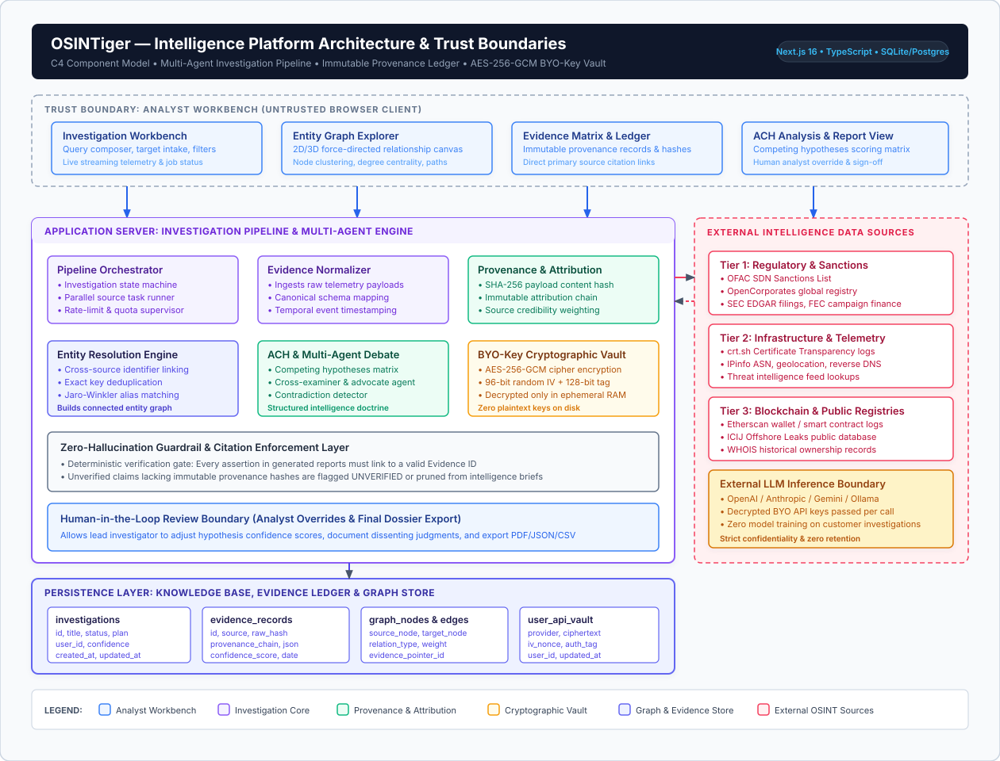

# OSINTiger: Multi-Source Intelligence & Threat-Research Platform

> Distributed open-source intelligence collection, evidence provenance, and multi-agent hypothesis analysis engine engineered with strict source attribution and zero-hallucination guardrails.

[](https://github.com/shivanshjain456/osintiger/actions/workflows/ci.yml)
[](https://nodejs.org)
[](https://nextjs.org)
[](https://www.typescriptlang.org)
[](https://vitest.dev)
[](LICENSE)

---

## Summary

- **Problem**: Most AI-assisted intelligence tools act as thin, unverified wrappers around commercial LLMs. They present probabilistic generated text without verifiable provenance, fail to cross-corroborate conflicting reports, suffer from hallucinations on critical indicators, and store third-party credentials insecurely.
- **Solution**: OSINTiger is an engineered intelligence platform that decouples deterministic telemetry harvesting from model-assisted reasoning:
  - Aggregates telemetry across 74 distinct public sources (DNS, TLS certificate logs, corporate registries, sanction lists, blockchain explorers, threat intelligence feeds) with zero paid API keys required.
  - Zero-hallucination protocol: every claim extracted by generative models is programmatically validated against raw source payloads. Statements lacking explicit `[SOURCE: <name>, URL: <url>]` citations are flagged for mandatory human review.
  - Immutable evidence provenance: hashes all raw source payloads using SHA-256 upon ingestion, maintaining an auditable chain of custody across 10 provenance dimensions.
  - Cognitive hypothesis evaluation: implements Richards Heuer's CIA methodology (Analysis of Competing Hypotheses) alongside an adversarial Advocate vs Skeptic debate engine.
  - Cryptographic credential safety: encrypts user-supplied BYO-LLM API keys at rest using AES-256-GCM with unique 16-byte initialization vectors and scrypt key derivation.
- **Target Audience**: Cybersecurity defensive operations, threat intelligence analysts, compliance auditors, due-diligence investigators, and academic security researchers.

---

## Key Engineering Highlights

| Architectural Dimension | Engineering Implementation | Why It Matters |
|---|---|---|
| **Zero-Hallucination Guardrails** | Automated regex citation parser enforces `[SOURCE: ..., URL: ...]` tags across all findings (`src/lib/osint/attribution.ts`). | Prevents ungrounded generative model hallucinations from polluting threat-intelligence assessments. |
| **Evidence Provenance & Integrity** | SHA-256 hashing of raw API payloads recorded in an append-only `ProvenanceEvent` ledger (`src/lib/osint/provenance.ts`). | Guarantees an immutable chain of custody so analysts can trace every high-level claim back to its exact raw response. |
| **Adversarial Cognitive Modeling** | Richards Heuer ACH matrix (`ach.ts`) and multi-agent debate (`multi-agent-debate.ts`) testing alternative scenarios. | Eliminates analyst confirmation bias by explicitly measuring evidentiary inconsistency across competing hypotheses. |
| **Multi-Tier Source Reliability** | Admiralty/NATO STANAG 5-tier reliability model (Tier 5 Authoritative to Tier 1 Unverified) (`confidence-engine.ts`). | Prevents informal community commentary from carrying the same evidential weight as government registers (SEC, OFAC). |
| **Cryptographic Credential Security** | User-supplied API keys encrypted at rest via AES-256-GCM; decrypted strictly in-memory during dispatch (`llm-provider.ts`). | Prevents exposure of sensitive analyst credentials even if SQLite database files or backups are compromised. |
| **Distributed Asynchronous Pipeline** | Non-blocking 8-step orchestrator with per-source 10s timeouts, partial-failure tolerance, and status polling (`pipeline.ts`). | Slow or failing upstream APIs never hang the investigation lifecycle or block concurrent requests. |

---

## Architecture & System Topology

The diagram below illustrates OSINTiger's C4 Component model, mapping the flow from the untrusted analyst browser surface through the investigation pipeline, evidence normalizer, provenance ledger, and AES-256-GCM encrypted BYO-key vault out to external intelligence sources and LLM inference providers.

[](https://viewer.diagrams.net/?highlight=0000ff&edit=_blank&layers=1&nav=1&title=architecture.drawio.svg#Uhttps%3A%2F%2Fraw.githubusercontent.com%2Fshivanshjain456%2Fosintiger%2Fmain%2Fdocs%2Farchitecture%2Farchitecture.drawio.svg)

> **Interactive Diagram Navigation:**
> [Open interactive diagram](https://viewer.diagrams.net/?highlight=0000ff&edit=_blank&layers=1&nav=1&title=architecture.drawio.svg#Uhttps%3A%2F%2Fraw.githubusercontent.com%2Fshivanshjain456%2Fosintiger%2Fmain%2Fdocs%2Farchitecture%2Farchitecture.drawio.svg) | [Edit diagram](https://app.diagrams.net/#Hshivanshjain456%2Fosintiger%2Fmain%2Fdocs%2Farchitecture%2Farchitecture.drawio.svg) | [Diagram source](docs/architecture/architecture.drawio.svg) | [Architecture docs](docs/architecture/README.md)
> 
> *Secondary Flow:* [Open Pipeline Flow diagram](https://viewer.diagrams.net/?highlight=0000ff&edit=_blank&layers=1&nav=1&title=core-flows.drawio.svg#Uhttps%3A%2F%2Fraw.githubusercontent.com%2Fshivanshjain456%2Fosintiger%2Fmain%2Fdocs%2Farchitecture%2Fcore-flows.drawio.svg) | [Edit Pipeline Flow](https://app.diagrams.net/#Hshivanshjain456%2Fosintiger%2Fmain%2Fdocs%2Farchitecture%2Fcore-flows.drawio.svg)

### Key Architectural Decisions Visible in the Diagram

1. **Deterministic Telemetry Decoupling**: External intelligence sources (OFAC, crt.sh, SEC EDGAR, IPinfo) are queried via structured TypeScript handlers rather than autonomous model loops, ensuring predictable API quota consumption and testability.
2. **Immutable Provenance Ledger**: Every ingested evidence item receives an immutable SHA-256 hash digest of its raw payload. Findings in generated reports must link to an authenticated Evidence ID or be rejected by the zero-hallucination guardrail.
3. **AES-256-GCM BYO-Key Cryptographic Vault**: User-provided LLM API tokens are encrypted at rest with authenticated cipher tags (`auth_tag`), decrypted exclusively in ephemeral RAM during inference, and never logged or written to persistent files.
4. **Structured Cognitive Analysis (ACH)**: Implements Richards Heuer's Analysis of Competing Hypotheses via multi-agent adversarial debate (Advocate vs. Skeptic) to systematically identify confirmation bias and evaluate diagnostic consistency.

---

## Technical Stack

- **Application Core**: Next.js 16 (App Router, Turbopack), React 19, TypeScript 5.x (strict mode).
- **Styling & Design System**: Tailwind CSS, Radix UI primitives (shadcn/ui), Lucide icons, responsive dark-mode theme.
- **Database & Persistence**: SQLite 3 with Write-Ahead Logging via Prisma ORM (configurable to PostgreSQL for enterprise deployments).
- **Security & Cryptography**: Native Node.js `crypto` (AES-256-GCM encryption, scrypt key derivation, SHA-256 evidence hashing), bcryptjs for password authentication.
- **AI & Synthesis Engine**: Multi-provider LLM abstraction supporting OpenAI, Anthropic, and default SDK with AES-256-GCM encrypted credential storage.
- **Testing & Quality Assurance**: Vitest 4 with 18 automated test suites asserting 308 tests across core analytical logic.

---

## Visual Proof & Terminal Demonstration

### Automated Test Suite Execution (Vitest)

```text
$ npm test

> osintiger@1.0.0 test
> vitest run

 RUN  v4.1.10 C:/Projects/3. PERSONAL/OSINTiger

 ✓ src/lib/osint/__tests__/store.test.ts (12 tests)
 ✓ src/lib/osint/__tests__/confidence-engine.test.ts (7 tests)
 ✓ src/lib/osint/__tests__/safe-json.test.ts (23 tests)
 ✓ src/lib/osint/__tests__/detector.test.ts (21 tests)
 ✓ src/lib/router/__tests__/registry.test.ts (11 tests)
 ✓ src/lib/osint/__tests__/router.test.ts (11 tests)
 ✓ src/lib/osint/__tests__/playbooks.test.ts (10 tests)
 ✓ src/lib/osint/__tests__/attribution.test.ts (3 tests)
 ✓ src/lib/osint/__tests__/ach.test.ts (8 tests)
 ✓ src/lib/saas/__tests__/notifications.test.ts (6 tests)
 ✓ src/lib/saas/__tests__/plans.test.ts (46 tests)
 ✓ src/lib/osint/__tests__/api-handler.test.ts (14 tests)
 ✓ src/lib/osint/__tests__/safe-error.test.ts (17 tests)
 ✓ src/lib/osint/__tests__/data-integrity.test.ts (30 tests)
 ✓ src/lib/router/__tests__/router.test.ts (26 tests)
 ✓ src/lib/saas/__tests__/entitlements.test.ts (49 tests)
 ✓ src/lib/osint/__tests__/llm-security.test.ts (6 tests)
 ✓ src/lib/__tests__/auth-utils.test.ts (8 tests)

 Test Files  18 passed (18)
      Tests  308 passed (308)
   Duration  5.18s
```

---

## Getting Started: Local Development

### Prerequisites
- Node.js 20.x, 21.x, or 22.x
- npm 10.x or higher (or bun 1.1+)
- Git

### 1. Clone & Install
```bash
git clone https://github.com/shivanshjain456/osintiger.git
cd osintiger
npm install --no-audit --no-fund
```

### 2. Environment Configuration
Create a local `.env.local` file from the safe template:
```bash
cp .env.example .env.local
```
Key development settings in `.env.example`:
- `DATABASE_URL`: Defaults to `file:./db/osintiger.db`.
- `LLM_ENCRYPTION_KEY`: 64-character hex key used to encrypt user API keys at rest.
- Optional API keys (VirusTotal, AbuseIPDB, Etherscan): left blank by default; all baseline sources run with zero keys.

### 3. Database Initialization & Synthetic Seeding
```bash
# Push schema to local SQLite store
npx prisma generate
npx prisma db push --skip-generate

# Seed plan tiers and rich synthetic demonstration records
npm run seed:plans
npm run seed:demo
```

### 4. Run the Development Server
```bash
npm run dev
```
Open [http://localhost:3000](http://localhost:3000) in your browser to access the investigation console.

---

## Testing Strategy & Quality Gates

OSINTiger enforces automated testing across all critical analytical modules. Tests run completely offline from clean clones without requiring third-party credentials.

```bash
# Run all 18 test suites (308 unit and integration tests)
npm test

# Run static linting
npm run lint

# Validate full production compilation
npm run build
```

Individual test suites can be inspected under [`src/lib/osint/__tests__/`](file:///c:/Projects/3.%20PERSONAL/OSINTiger/src/lib/osint/__tests__/):
- `attribution.test.ts`: Verifies programmatic enforcement of `[SOURCE]` citations.
- `confidence-engine.test.ts`: Asserts multi-dimensional reliability calculations.
- `llm-security.test.ts`: Tests AES-256-GCM encryption, tampering rejection, and key safety.
- `detector.test.ts`: Tests regex target parsing across 11 formats.

For complete documentation on the test harness, refer to [docs/testing.md](docs/testing.md).

---

## Project Structure

```text
osintiger/
├── .github/
│   ├── workflows/ci.yml        # CI pipeline (lint, test, build)
│   └── dependabot.yml          # Automated dependency updates
├── docs/                       # Technical engineering documentation
│   ├── architecture.md         # In-depth system design and topologies
│   ├── design-decisions.md     # Architectural Decision Records (ADRs)
│   ├── testing.md              # Test architecture and coverage proofs
│   ├── security.md             # Security architecture and cryptographic models
│   ├── operations.md           # Production runbooks and health endpoints
│   ├── limitations.md          # Honest boundaries and scaling limits
│   └── recruiter-review.md     # 3-minute executive technical summary
├── prisma/
│   └── schema.prisma           # Prisma models for investigations, KB, and provenance
├── public/                     # Static brand assets, favicon, and social cards
│   ├── brand/                  # Vector lockups, app icons, and marks
│   ├── og-image.png            # Social preview card
│   └── favicon.png             # Application favicon
├── scripts/                    # Utility scripts, seeders, and build helpers
│   ├── copy-standalone.js      # Cross-platform standalone asset bundler
│   ├── seed-demo.ts            # Synthetic demonstration data seeder
│   └── seed-plans.ts           # Subscription tiers seeder
├── src/
│   ├── app/                    # Next.js App Router (SPA console and 80+ API routes)
│   ├── components/             # UI components and analytical panels
│   │   ├── osint/              # Intelligence panels (ACH, Link Graph, Threat Matrix)
│   │   └── ui/                 # Accessible Radix UI primitives
│   ├── lib/
│   │   ├── osint/              # Core intelligence engine
│   │   │   ├── sources/        # 74 modular OSINT telemetry collectors
│   │   │   ├── ach.ts          # Richards Heuer hypothesis matrix
│   │   │   ├── attribution.ts  # Zero-hallucination citation enforcement
│   │   │   ├── confidence-engine.ts # Admiralty/NATO reliability engine
│   │   │   ├── llm-provider.ts # AES-256-GCM credential encryption
│   │   │   ├── pipeline.ts     # 8-step asynchronous orchestrator
│   │   │   └── provenance.ts   # SHA-256 evidence chain of custody
│   │   └── router/             # Type-safe hash-based SPA router
├── LICENSE                     # MIT License with responsible-use notice
├── package.json                # Project dependencies and script declarations
├── README.md                   # This documentation file
└── SECURITY.md                 # Vulnerability reporting and ethics policy
```

---

## Ethical Boundaries & Responsible Use Notice

OSINTiger is designed strictly for defensive cybersecurity operations, authorized security posture assessments, compliance screening, and academic research.

- **Defensive Focus**: Use this software only against systems, networks, and domains that you own or have explicit written permission to investigate.
- **Zero Harassment Policy**: The project prohibits any application toward personal doxxing, harassment, non-consensual surveillance, or stalking of private individuals.
- **Privacy & Compliance**: Users must comply with all relevant legal requirements (GDPR, CCPA) and upstream provider terms of service.

Refer to [SECURITY.md](SECURITY.md) for complete details.

---

## Known Limitations & Design Boundaries

1. **Upstream Rate Limits**: Queries to public unauthenticated endpoints (crt.sh, SEC EDGAR, DuckDuckGo) are subject to third-party rate limits. High-frequency automated scanning requires configuring dedicated commercial API keys.
2. **Curated OFAC Dataset**: The embedded sanctions screening module uses a curated subset of the US Treasury OFAC SDN roster with Levenshtein fuzzy matching. It is intended for preliminary triage, not certified banking-grade AML screening.
3. **Single-Node Persistence Ceiling**: The default SQLite database serializes write transactions. Deployments exceeding 100 concurrent write-heavy investigations per minute should configure Prisma to PostgreSQL.
4. **Model Latency**: Generative AI synthesis and multi-agent debate require 3 to 10 seconds per scan depending on upstream provider responsiveness.

For complete documentation on architectural ceilings and roadmap goals, see [docs/limitations.md](docs/limitations.md).

---

## Individual Engineering Ownership

Key areas of personal engineering ownership across the project include:
- Designing the distributed 8-step pipeline with parallel collector dispatch and timeout isolation.
- Architecting the zero-hallucination attribution validator and automated citation verification engine.
- Implementing the immutable SHA-256 evidence provenance ledger for audit tracking.
- Engineering the AES-256-GCM credential encryption subsystem for BYO-LLM key isolation.
- Formulating the multi-dimensional confidence engine based on Admiralty/NATO reliability tiers.
- Building the comprehensive test suite with 18 automated test suites asserting 308 passing tests.
- Authoring the technical documentation suite, ADRs, operations runbooks, and CI automation.

---

## Technical Documentation Navigation

- [System Architecture Specification](docs/architecture.md): System topology, 8-step pipeline, and component boundaries.
- [Architectural Decision Records (ADRs)](docs/design-decisions.md): Detailed tradeoffs and design rationale.
- [Testing Strategy & Evidentiary Verification](docs/testing.md): Test harness breakdown and coverage proofs.
- [Security Architecture & Cryptographic Controls](docs/security.md): Threat vectors, encryption, and SSRF prevention.
- [Operations & Production Deployment](docs/operations.md): Setup instructions, systemd guide, and health probes.
- [Engineering Boundaries & Limitations](docs/limitations.md): Scale limits and non-guarantees.
- [Recruiter & Interviewer Technical Quick-Review](docs/recruiter-review.md): 3-minute executive review guide.

---

## License

This project is licensed under the [MIT License](LICENSE).
